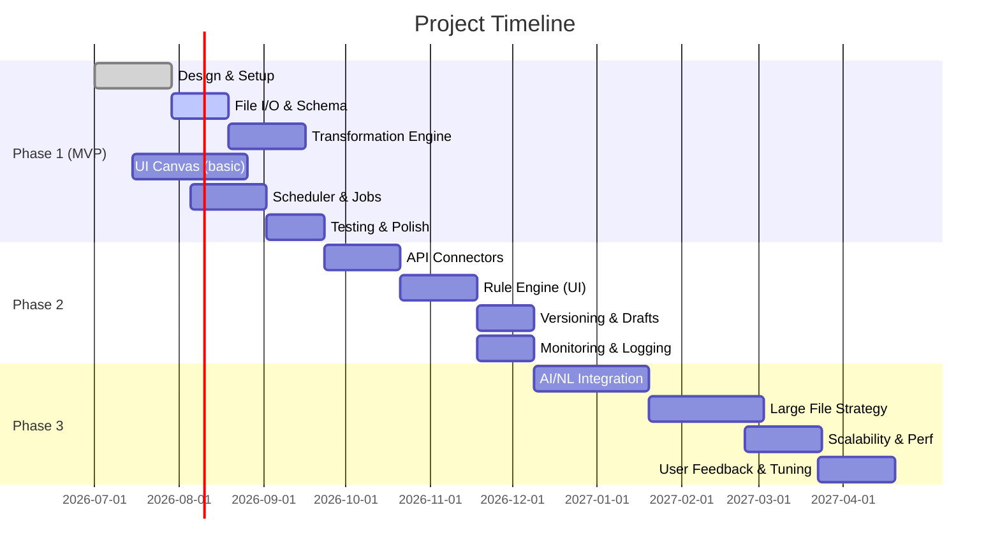

# Self-Service Data Transformation Platform: Roadmap

**Executive Summary:** We propose an **MVP** (4–6 months) to build a low-code data transformation SaaS that lets non-technical users upload CSV/Excel/XML/JSON or call REST APIs, auto-detect schemas, build visual transformation workflows, and schedule recurring runs.  Over time (Phase 2, Phase 3) we add advanced connectors, a visual rule engine, AI-driven prompts, versioning/drafts, and scalable processing for large datasets.  The key layers are: a **React/TypeScript frontend** with a drag‑drop workflow canvas (e.g. React Flow), a **FastAPI (Python)** backend, a **rule/transform engine** (using pandas/Polars/DuckDB), a **workflow scheduler** (Celery+Redis/RabbitMQ), and storage (PostgreSQL + S3/MinIO).  This plan outlines phase-wise goals, user stories, UI flows, data models, examples of rules/DSL, schema detection, file I/O strategies (chunking/Parquet), background jobs, API design, security, infra, testing, and migration to .NET if needed.  We cite industry best practices and Python-first tech (e.g. Airbyte connectors, Polars vs Pandas performance, Celery for tasks, etc.) throughout. 

## Phase 1 (MVP): Ingest & Transform

**Goals:** Enable users to **upload/import data**, define simple column transformations, preview output, and export data.  Support file formats **CSV, Excel, XML, JSON** (and REST API read/write), and output to CSV/Excel/XML/JSON.  Core features: schema inference, **point-and-click transformations** (add/rename/delete columns, basic formulas like “Age = today – DOB”, text cases, replace values, lookups, etc.), schedule runs (e.g. every n hours), view run logs, and download results.  No coding – users build workflows on a canvas. This mirrors ETL tools (Airbyte, n8n) but aimed at non-technical users.

**User Stories (MVP):** Sample stories include:
- *“As a non-technical user, I can upload a CSV/Excel/XML/JSON file or connect to a REST API, so that the system auto-detects its schema and shows a data preview.”*
- *“As a user, I can add a transformation node that creates a new column “Age” from a “DOB” column, and see a preview of the new data.”*
- *“As a user, I can rename or delete columns using the UI.”*
- *“As a user, I can schedule this workflow to run every 2 hours, and get a status report.”*

**UI/UX (MVP):** The UI is a simple web app (e.g. **Next.js + TypeScript**). Key screens:
- **Data Upload/Source:** File upload or API connector form. On upload, show table preview with inferred schema (data types, sample rows).
- **Workflow Canvas:** A drag‑drop canvas (using [React Flow](https://reactflow.dev/){.underline}) with nodes like *CSV Source*, *Transformation*, and *Export*. Users connect nodes by edges to define flow. Built‑in nodes: *CSV/Excel/XML Reader*, *JSON/API Reader*, *Transform*, *Join/Merge*, *Conditional*, *API Writer*, *File Writer*.
- **Transformation Configuration:** When clicking a *Transform* node, a side panel appears to configure rules (e.g. “Add column Age = extract_age(DOB)”, or “Replace country names with ISO3 code”).
- **Preview Pane:** Live preview of results after each node (like a mini data table), enabling users to verify rule effects.
- **Schedule & Run:** UI to set recurring schedules (e.g. Cron syntax) and run workflows manually. Show run history with status (Success/Failed) and logs.
- **Versioning:** Simple controls to *Save Draft*, *Publish Workflow*, and *Revert to Previous Version*.

  **Workflow Canvas Behavior:** Users drag connectors from a palette onto canvas. Nodes can be moved, connected by lines, and configured. Typical canvas flow: 

  ```mermaid
  flowchart LR
    A[File/API Input] --> B[Transform Rules] --> C[Output (File/API)]
    style A fill:#DDEBF7,stroke:#2563EB,stroke-width:2px
    style B fill:#DFF5E0,stroke:#166534,stroke-width:2px
    style C fill:#FDF4E5,stroke:#92400E,stroke-width:2px
  ```
  The canvas supports **drag-drop**, **selection**, **undo/redo**, and **export/import JSON**. The React Flow library provides these out of the box. For example, Zapier’s workflow builder and other node-based UIs follow this pattern. 

**Data Model:** Relational tables (PostgreSQL) or JSON in DB:
- **Workflow**: id, name, owner, JSON config (nodes+edges), created/updated timestamps.
- **Node**: type (source, transform, sink), parameters (e.g. file path, column rules) stored in JSON.
- **Schedule**: workflow_id, cron_expr, next_run, enabled.
- **RunLog**: workflow_id, start_time, end_time, status, error_message.
- **User/Credentials**: for API connectors or auth.
- Schema inference may produce metadata (columns, types) stored in memory only or cache.

## Phase 2: Advanced Features (Connectors & Rules)

**Goals:** Add **API connectors**, a **visual rule engine**, rule-based triggers, version history, error handling and simpler ML/NL capabilities. Mature the ETL capabilities toward production readiness.

1. **API Connectors**: Support REST API sources and sinks with auth (API keys, OAuth). Users fill endpoint URL, auth credentials, query params, etc. Use Python libraries (`requests`, `httpx`) to call APIs, ingest JSON/XML into DataFrames. Support pagination and webhooks. 
   - Reference: Airbyte connectors demonstrate managed auth and a catalog of 600+ sources/destinations. We’ll emulate such connectors (e.g. Twitter API, Google Sheets, Salesforce).
2. **Rule Engine (Visual Rules):** Allow users to define rules in a more abstract way. Instead of coding, users get a form or dialog to add a rule (if-then). For example: *“If Country = INDIA then CountryCode = 'IND'”*, or *“Compute Age = (today - DOB)/365”*. The system translates rules into Pandas/Polars operations or SQL. 
   - **Design:** Internally, we can adapt an open-source rule engine like [etlrules](https://pypi.org/project/etlrules) (which uses YAML “plans” of transformations) or a simple custom evaluator.  
   - **Examples:**
     ```yaml
     rules:
       - name: "Compute Age"
         description: "Calculate age from birth date"
         expression: "Age = (CURRENT_DATE - DOB).days // 365"
       - name: "Country to ISO3"
         description: "Convert country names to ISO3 codes"
         map:
           USA: "USA"
           India: "IND"
           Germany: "DEU"
       - name: "Operator from Phone"
         description: "Infer telecom operator from phone prefix"
         pattern: "^(\\+91)"
         result: "Operator = 'Vodafone'"
     ```
   - The engine executes these rules on dataframes. This lets non-coders build logic; rules can be saved in YAML/JSON for versioning.
3. **Preview & Drafts:** Users can save workflows as drafts and preview results without publishing. Version history lets them revert changes.
4. **Error Handling:** Provide try/catch semantics in pipelines. For instance, if a node fails, mark the run as failed, log the error, and optionally send email notifications. Support retry logic (automatic retries on transient errors) via Celery’s retry mechanism.
5. **Monitoring/Logging:** Integrate logging (Python `logging` and error capturing). Use Prometheus/Grafana for metrics (FastAPI has exporters), and Sentry or similar for error alerts.
6. **Advanced Transformations:** Add tasks like joins/merges between datasets, lookups (static reference tables), aggregations, pivot/unpivot. 
7. **Data Quality Checks:** Optionally include simple validation rules (e.g. “Column X must be unique”, “Column Y not null”). Failed checks generate warnings.

## Phase 3: AI/NL & Scaling

**Goals:** Introduce **AI-assisted building**, auto-completion of transformations, handle very large datasets, and production robustness.

1. **Natural Language Interface:** Users type or select goals. For example, a textbox “Generate an Age column from DOB”; or “Map country names to ISO codes”. Behind the scenes, use an LLM (OpenAI/Claude) with a prompt to output a transformation plan (in JSON/YAML) that the system then executes. Preliminary examples:
   - **User:** “Create workflow: read CSV, add Age column, output JSON.”
   - **AI Plan:** (Pseudocode) `{source: CSV, transforms: [ {"type": "formula", "target": "Age", "formula": "floor((today - date(DOB)) / 365)"} ], output: JSON}`.
   - **Reference:** Etlrules author hints at AI usage: “Workflows can be managed and versioned, and AI prompts can guide non-technical users to define rules”.
2. **Large-Scale Processing:** For big files (millions of rows):
   - **Streaming/Chunking:** If data doesn’t fit in memory, read in chunks. Pandas: `read_csv(chunksize=...)`, processing chunk by chunk. Or switch backend to [Polars](https://pola.rs) or [DuckDB](https://duckdb.org):
     - **Polars:**  Polars is a Rust-based DataFrame that is 5–100× faster than pandas on large data, uses arrow columnar format, and multi-threading. E.g. `pl.read_csv()` can load large files efficiently. Use Polars for transformations or convert chunks to Polars for heavy ops.
     - **DuckDB:** An in-process OLAP database; can query CSV/Parquet via SQL. For example, `duckdb.query("SELECT * FROM 'data.csv'")` bypasses Python overhead. Good for complex joins/aggregations on big data with low memory.
     - **Intermediate Formats:** Convert incoming files to Apache Parquet/Arrow format as an optimization. Parquet/Feather are highly efficient for repeated reads.
   - **Distributed/Cluster:** (Optional future) Offload to Dask or Ray if multi-node needed.
   - **Storage:** Use S3 or MinIO for large file storage. Possibly use S3 Select for partial reads.
3. **Scheduler & Orchestration:** Use Celery (with Redis or RabbitMQ). Celery handles asynchronous execution of workflows. Use **Celery Beat** for scheduling recurrent tasks. Reference: Celery is the de-facto Python task queue for background jobs. RabbitMQ is recommended as broker for robust delivery.
4. **Authentication & Security:** Support OAuth2/JWT (via FastAPI’s built-in OAuth2 tools) for user login and API access. Store user credentials, use HTTPS, role-based access for workspaces. For connectors (APIs) store credentials encrypted.
5. **Collaboration:** Users can share or publish workflows. Role management to allow team roles.

## Architecture Overview

```mermaid
flowchart LR
    UI[Next.js App (React, React Flow UI)] -->|REST/GraphQL| API[FastAPI Backend]
    API --> Auth[(Auth: OAuth2/JWT)]
    API --> WorkflowSrv[Workflow Service]
    WorkflowSrv --> Orchestrator[Celery Workers (tasks)]
    WorkflowSrv --> DB[(PostgreSQL)]
    Orchestrator --> DataProc[Data Processing (Pandas/Polars/Arrow)]
    DataProc -->|read/write| FileStore[(S3/MinIO)]
    Orchestrator -->|read/write| DB
    Orchestrator --> Cache[(Redis broker)]
    API -->|publish tasks| Cache
```

- **Frontend:** Modern React (Next.js) app with React Flow for the workflow canvas. Handles user actions and calls backend APIs.
- **Backend:** FastAPI (Python 3.10+) for REST endpoints, authentication, and control logic. Implements business logic (workflow CRUD, scheduling, logging).
- **Workflow/Rule Engine:** A service that interprets workflow JSON/DSL, schedules tasks, and applies transformations. Uses Pandas/Polars/DuckDB to execute data ops.
- **Task Queue:** Celery + RabbitMQ/Redis. FastAPI enqueues tasks (e.g. “run this workflow”) to Celery workers.
- **Workers:** Celery workers pull tasks, run the workflow step-by-step, using Pandas/Polars to process data.
- **Storage:** PostgreSQL for metadata (users, workflows, logs). S3/MinIO for file storage. Redis for Celery broker and caching intermediate results.
- **Monitoring:** Export metrics from FastAPI (Prometheus client) and Celery. Use Grafana dashboards, and error logging (e.g. Sentry).
- **Deployment:** Containerized (Docker), orchestrated via Kubernetes for scaling. CI/CD via GitHub Actions.

## Technologies Comparison

| Layer            | Option                  | Pros/Cons                                 | Reference |
|------------------|-------------------------|-------------------------------------------|-----------|
| **Backend**      | Python (FastAPI)        | High performance, async, Pythonic; rich ecosystem for ML/ETL; easy concurrency (asyncio). | – |
|                  | C# (.NET Core)          | Enterprise support, good for Windows/Enterprise customers, but less data-science friendly. | – |
| **Web Framework**| FastAPI                 | Async, auto-doc, lightning-fast (ASGI); favoured for APIs. | – |
|                  | Django/Flask            | Heavier or slower; not needed for microservices. | – |
| **DataFrame**    | Pandas                  | Familiar, broad ecosystem, but single-threaded and memory-heavy for big data. | – |
|                  | Polars                  | Rust-based, 5–100× faster on big data; efficient multi-core. |  |
|                  | DuckDB                  | SQL interface to files; super-fast CSV/Parquet queries in-process. | – |
|                  | Dask/Ray                | Distributed, for very large workloads (future). | – |
| **ETL Orchestration**| Celery (Python)      | Mature, feature-rich; integrates with FastAPI; supports retries, scheduling. |  |
|                  | Prefect/Airflow         | More complex; overhead; not strictly needed for MVP. | – |
| **Message Broker**| RabbitMQ                | AMQP, reliable, recommended for Celery. |  |
|                  | Redis                   | Simple, fast; can broker and cache; Celery backend. |  |
| **Scheduler**    | Celery Beat             | Built-in periodic tasks. | – |
|                  | APScheduler             | Could be used, but Celery Beat suffices. | – |
| **Queue**        | Redis/RabbitMQ (as above) | – | – |
| **Frontend**     | React / Next.js         | Modern, SEO-friendly, TypeScript. React Flow for canvas. | – |
|                  | Vue/Angular             | Viable, but ecosystem favors React (React Flow). | – |
| **Workflow Canvas**| React Flow            | Rich nodes/edges out-of-box; MIT license. |  |
|                  | Draw2D/Diagram etc.     | Alternative libraries exist; React Flow is most popular. | – |
| **Storage**      | PostgreSQL              | Robust, JSON support, flexible schema. | – |
|                  | MongoDB/NoSQL           | Could store workflows, but relational works well. | – |
| **Object Storage**| AWS S3 / MinIO         | Scalable file store for uploads/exports. MinIO is on-prem S3. | – |
| **Monitoring**   | Prometheus + Grafana    | Standard for metrics, dashboards. | – |
|                  | Sentry / Elastic Stack  | For logging and error aggregation. | – |
| **CI/CD**        | GitHub Actions / GitLab | Integrate linting, tests, Docker build, k8s deploy. | – |
| **Infra**        | Docker + Kubernetes     | Containerize all components; k8s for scaling. | – |
|                  | AWS/EKS or GCP/K8s      | Use cloud provider of choice for k8s, RDS, S3. | – |

## Data Ingestion & Schema Detection

- **CSV:** Use pandas or Polars (`read_csv`) for small/medium files. For large files, process in chunks (pandas `read_csv(chunksize=...)`) or use Polars/DuckDB to stream directly (no need for explicit chunking in code). Pandas now supports `dtype_backend='pyarrow'` for efficiency.
- **Excel:** Use `pandas.read_excel` or [openpyxl](https://openpyxl.readthedocs.io/) via Pandas. For many rows, convert to CSV first or use `pandas.read_excel(..., engine='openpyxl')`. Dev-to notes using `openpyxl` for advanced Excel features (formulas, charts).
- **XML/JSON:** Pandas has `read_xml` and `read_json`. If structure is complex, parse with `lxml` or built-in JSON parser, then normalize. For APIs returning JSON lists, parse to DataFrame directly (`pd.json_normalize`).
- **Schema Detection:** On upload, quickly sample first N rows to guess types (`df.dtypes`). Pandas does type inference (int, float, datetime, string). For more intelligence, use libraries like [pandas' `convert_dtypes()`](https://pandas.pydata.org/docs/reference/api/pandas.DataFrame.convert_dtypes.html) or [DataProfiler](https://github.com/capitalone/DataProfiler) to detect data types, or ask user to override. Show column types in UI. Auto-detect columns like “DOB” as dates using heuristics or user hint.

## Transformation Engine

- **DSL/Config:** Define transformations in a JSON/YAML schema. Example snippet:
  ```json
  {
    "workflow": {
      "steps": [
        {"id": "src", "type": "read_csv", "params": {"path": "users.csv"}},
        {"id": "age", "type": "add_column",
         "params": {"name": "Age", "formula": "(today - date(DOB)).years"}},
        {"id": "iso", "type": "lookup_map",
         "params": {"source": "Country", "map": {"India": "IND", "USA": "USA"}}},
        {"id": "sink", "type": "write_excel",
         "params": {"path": "output.xlsx"}}
      ]
    }
  }
  ```
  Each step corresponds to a node on the canvas.  
- **Rule Examples:** 
  - *Age from DOB*: `Age = floor((today - DOB)/365)`.  
  - *Country→ISO3*: Use a static map (e.g. `{'India':'IND','Germany':'DEU'}`) or an external lookup API.  
  - *Phone prefix→Operator*: Regex or number parsing (e.g. `if mobile.startswith('+91'): operator='Vi'`).
- **Engine Execution:** Iteratively apply steps to a Pandas/Polars DataFrame. For example, in Pandas: `df['Age'] = (pd.Timestamp('today') - pd.to_datetime(df['DOB'])).dt.days // 365`.  For lookup maps: use `df['CountryCode'] = df['Country'].map(country_to_iso_map)`.
- **Validation:** After each transform, validate outputs (e.g. no new nulls unless expected) and log anomalies.

## API Design

- **FastAPI Endpoints:** 
  - `POST /workflows` – create workflow (JSON body), returns ID.  
  - `GET /workflows/{id}` – fetch workflow config.  
  - `PUT /workflows/{id}` – update workflow.  
  - `DELETE /workflows/{id}` – delete.  
  - `POST /workflows/{id}/run` – trigger execution now.  
  - `GET /workflows/{id}/runs` – list run history.  
  - `POST /workflows/{id}/schedule` – set schedule (cron).  
  - `GET /jobs/{job_id}/status` – query background job status.  
- **Security:** OAuth2 password flow + JWT tokens. Protect all routes. Possibly issue API tokens for integrations.
- **API for UI:** Use JSON responses. For file upload, use FastAPI’s `UploadFile`.
- **AI/Prompt API:** A special endpoint like `POST /workflows/{id}/suggest` where user input (NL description) returns generated steps (using OpenAI API or LangChain).

## Background Jobs & Scheduler

- **Celery:** Use Celery workers to run transformations asynchronously. On `POST /run`, FastAPI enqueues a Celery task (`run_workflow.delay(workflow_id)`) and returns a job ID. The worker executes the plan, writes outputs, updates status.  
- **Broker/Backend:** RabbitMQ or Redis as message broker. Celery can use Redis as broker and result backend. For production, RabbitMQ is more robust.  
- **Scheduling:** Celery Beat for periodic tasks. Alternatively, use APScheduler in Python. E.g. user schedules a cron, we store it and configure Celery Beat to enqueue the job at those times.  

## Storage & Scaling

- **File Storage:** Use S3 (AWS, GCP, Azure) or MinIO for on-prem S3. Store user-uploaded files and generated output files here. FastAPI can stream files to/from S3.  
- **Database:** PostgreSQL for metadata and lightweight data (small tables).  
- **Large Data:** For huge data, avoid moving everything through Python. Instead, consider:
  - Use DuckDB SQL to directly query and transform CSV/Parquet in place, then export result.
  - If dataset is truly massive, require the user to limit (or fall back to an enterprise pipeline).  
- **Concurrency:** Kubernetes autoscaling of workers, use separate Celery queues for heavy vs light tasks.

## UI/UX Details (Screenshots/Mockups)

*(Text description for brevity)*

1. **Upload Screen:** Prompts “Upload File or Connect API” with file browser or API form. After upload, a modal shows a sample of the data and detected column headers/types. Users can rename headers or mark key columns here.
2. **Workflow Canvas:** Left sidebar palette (nodes like Source, Transform, Filter, Export). Canvas area with a grid. Top toolbar: Save, Run, Schedule. Nodes clicked open property panels on the right.
3. **Configure Transform Node:** E.g. user adds a “Formula” node: in panel, select source column, enter formula or pick from presets (“Date difference”, “String replace”), specify new column name.
4. **Preview Pane:** Below canvas, a table that shows output of current workflow (first 10 rows). Updated live or on-demand.
5. **Schedule Dialog:** User picks daily/weekly etc., or enters cron. Option to enable email notifications on failure.
6. **Run History:** A list of past runs with timestamp, status (success/error), duration, and ability to download output.

## Example DSL/Config

```yaml
workflow:
  id: 42
  name: "Demo Workflow"
  version: 3
  steps:
    - id: src
      type: read_csv
      params:
        path: "s3://bucket/input.csv"
    - id: add_age
      type: add_column
      params:
        column_name: "Age"
        formula: "(today() - parse_date(DOB)).years"
    - id: iso_code
      type: lookup_map
      params:
        source_col: "Country"
        map: {"India": "IND", "Germany": "DEU", "USA": "USA"}
        target_col: "CountryCode"
    - id: write_out
      type: write_excel
      params:
        path: "s3://bucket/output.xlsx"
```

Workers read this JSON, then in Python code do something like:

```python
df = pd.read_csv(step.params['path'])
# Add Age column
df['Age'] = (pd.Timestamp('today') - pd.to_datetime(df['DOB'])).days // 365
# Lookup map
df['CountryCode'] = df['Country'].map({'India':'IND','Germany':'DEU','USA':'USA'})
df.to_excel('output.xlsx', index=False)
```

## Testing & CI/CD

- **Unit Tests:** Use PyTest to test individual functions (e.g. CSV parsing, rule application). Mock file I/O using temporary files.  
- **Integration Tests:** End-to-end tests using FastAPI’s TestClient. Test key endpoints (upload, run workflow). Use small sample datasets.  
- **Contract Tests:** For connectors, test API calls against sandbox endpoints (using e.g. Postman/Newman).  
- **CI Pipeline:** On commit, run `flake8`, `mypy`, `pytest`; build Docker images; push to registry.  
- **CD Pipeline:** Deploy images to dev environment, run smoke tests, then to production. Use Git tags for releases. Possibly use GitHub Actions or GitLab CI.

## Deployment & Infrastructure

- **Containerization:** Docker images for FastAPI app, Celery worker, PostgreSQL, Redis, UI.  
- **Orchestration:** Kubernetes cluster (managed or on-prem). Use Helm charts for deployment.  
- **Cloud:** AWS (EKS, RDS, S3) or GCP/Azure equivalents. Set up VPC, subnets, IAM, etc.  
- **Monitoring:** Prometheus scrape metrics from FastAPI and Celery (via [Prometheus FastAPI integration](https://pypi.org/project/fastapi-prometheus)). Grafana dashboards for task durations, success rates.  
- **Logging:** Ship logs to a central system (ELK or CloudWatch). Use structured JSON logs.

## Timeline (Gantt)



*(Dates illustrative; adjust per team size.)*

## Team & Effort

- **Team Composition:** 1 Product Owner/PM, 1 UI/UX Designer, 1 Tech Lead, 2–3 Backend Developers (Python), 2 Frontend Developers (React/TypeScript), 1 QA/Tester, DevOps Engineer.  
- **MVP:** ~4–6 months with a focused team (see timeline above).  
- **Full Prod:** 8–12 months to add all features.  
- **Estimated Effort:** ~1000–1500 story points for MVP (flexible). Non-tech clients can test early prototypes to refine requirements.

## Migration to .NET

If a .NET version is required later (e.g. enterprise policy), the migration path is:
- Replace FastAPI with ASP.NET Core Web API (C#). Both support similar middleware (JWT, controllers, etc.).  
- Swap Celery with [Hangfire](https://www.hangfire.io/) or [Quartz.NET](https://www.quartz-scheduler.net/) for scheduled jobs.  
- Replace Pandas with [Microsoft.Data.Analysis](https://learn.microsoft.com/dotnet/api/microsoft.data.analysis) or interoperate via PythonNET, though performance may be slower. Alternatively, use [Deedle](https://github.com/fslaborg/Deedle) for data frames in .NET.  
- UI (React/JS) remains the same.  
- The biggest challenge is the data processing stack: Polars has no .NET equivalent, so large-file performance may degrade. This is a downside of migrating. Carefully measure performance and consider keeping a Python microservice for heavy transforms if needed.  

## Prioritized Backlog (Examples)

1. **US001 – File Upload & Preview:**  
   - *AC:* User can upload CSV/Excel/XML/JSON. System displays first 10 rows and inferred column names/types.  
2. **US002 – Basic Transformations:**  
   - *AC:* User can add a transform node to add/rename/delete a column via the UI, and preview the result.  
3. **US003 – Download Output:**  
   - *AC:* After running workflow, user can download the output in CSV, Excel or JSON format.  
4. **US004 – Schedule Workflow:**  
   - *AC:* User can schedule workflow (e.g. daily at 2am) and view scheduled tasks. A test run executes at scheduled time.  
5. **US005 – Undo/Redo:**  
   - *AC:* On the canvas, user can undo/redo node edits. (Using React Flow’s history feature.)  
6. **US006 – Connector: REST API Source:**  
   - *AC:* User provides API endpoint and auth; system retrieves JSON data and continues processing.  
7. **US007 – Rule: Country ISO Code:**  
   - *AC:* User adds rule “Map country names to ISO3 codes”; after run, new column `CountryCode` has values like “IND” for India.  
8. **US008 – Versioning:**  
   - *AC:* User can save versions; view history; revert to an older version of workflow.  
9. **US009 – AI Prompt Builder:**  
   - *AC:* User types “create Age column from DOB”; system suggests adding a rule node to compute age.  
10. **US010 – Large File Handling:**  
    - *AC:* System processes 1M-row CSV via chunking or Polars without exhausting memory (test on <8GB RAM).  

*(More stories would detail each feature’s acceptance criteria.)*

## References & Emulation

We draw inspiration from existing tools:

- **Airbyte (https://airbyte.com)** – open-source ELT with many connectors and a no-code builder.
- **n8n (https://n8n.io)** and **Zapier** – workflow automation UIs (though more focused on triggers, not heavy data transforms). Their node-based editor idea is instructive.
- **Talend** and **Pentaho** – commercial ETL platforms (visual pipelines, data transformations).
- **Microsoft Power Query** – self-service data shaping (how-to guides).
- **React Flow** for the canvas (see its [Quickstart](https://reactflow.dev/guide/) and [showcase](https://reactflow.dev/#showcase) for examples).
- **pandas, Polars, DuckDB** documentation – to plan data pipeline code.

This plan synthesizes best practices from these sources, emphasizing Pythonic, AI-ready, scalable design. It aims for a practical MVP that can evolve into a full-featured SaaS product.